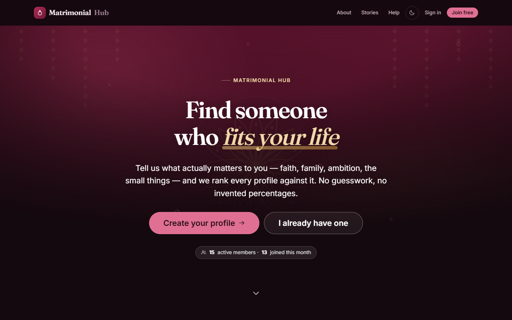
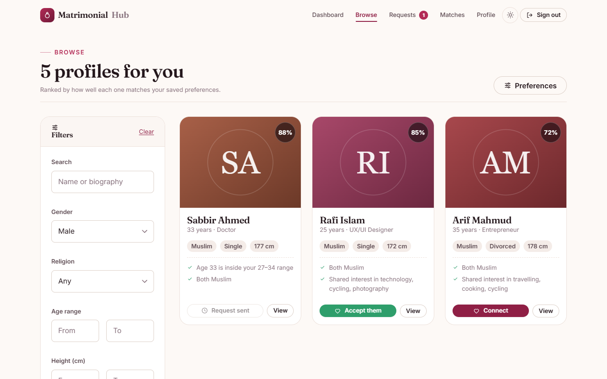
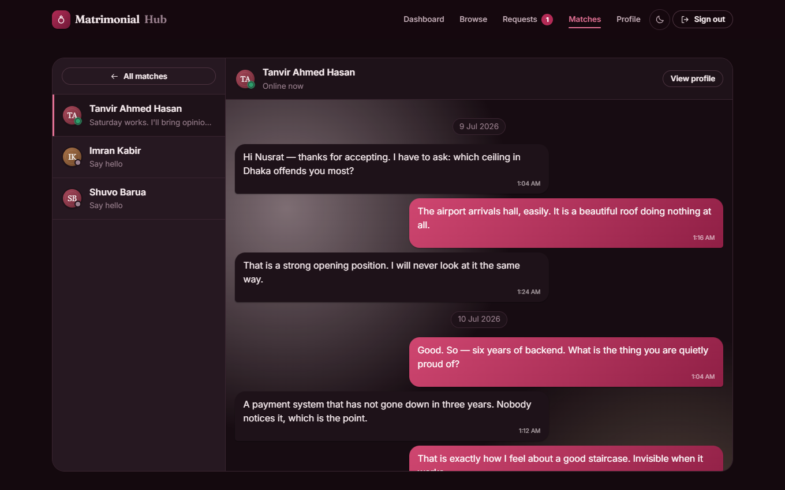
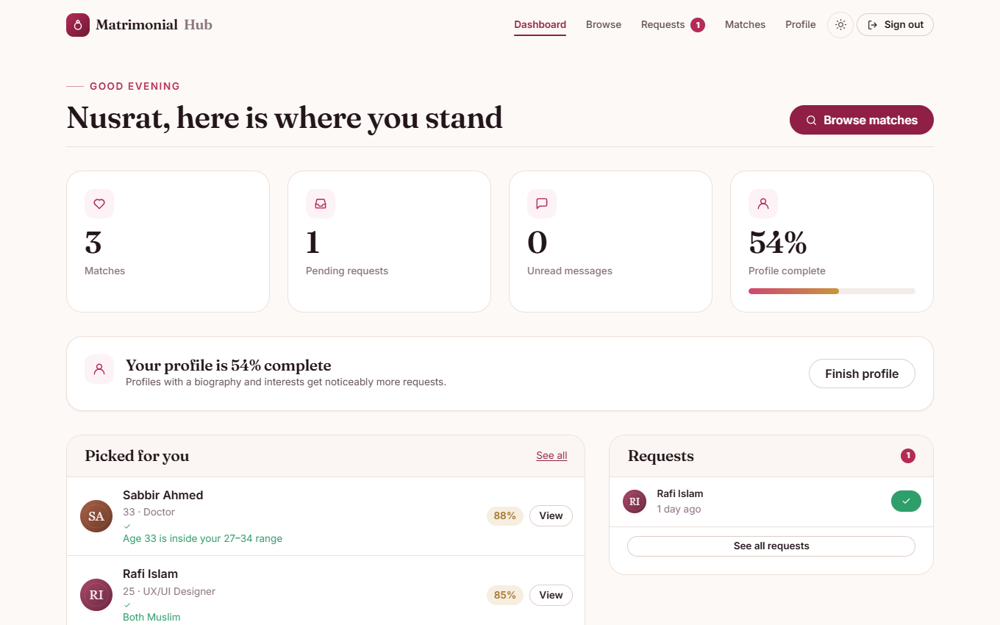
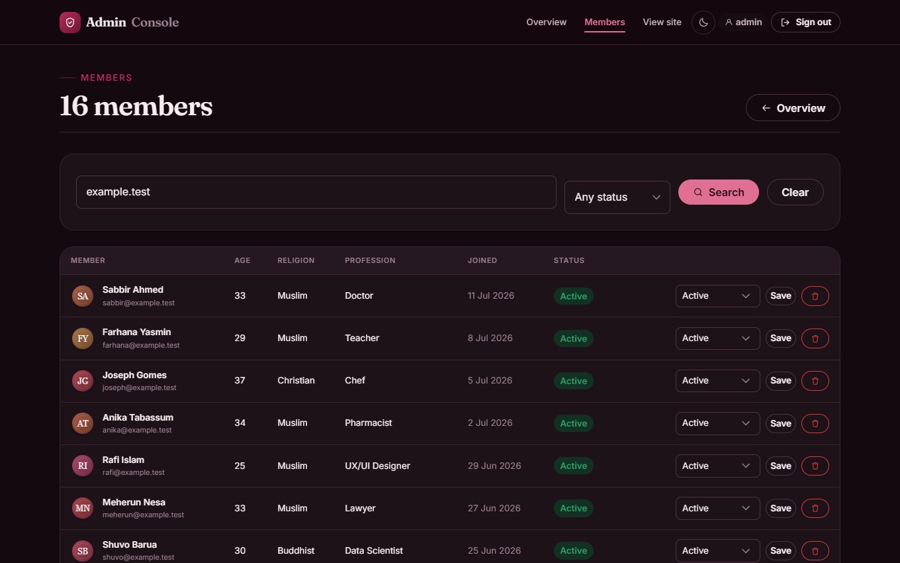
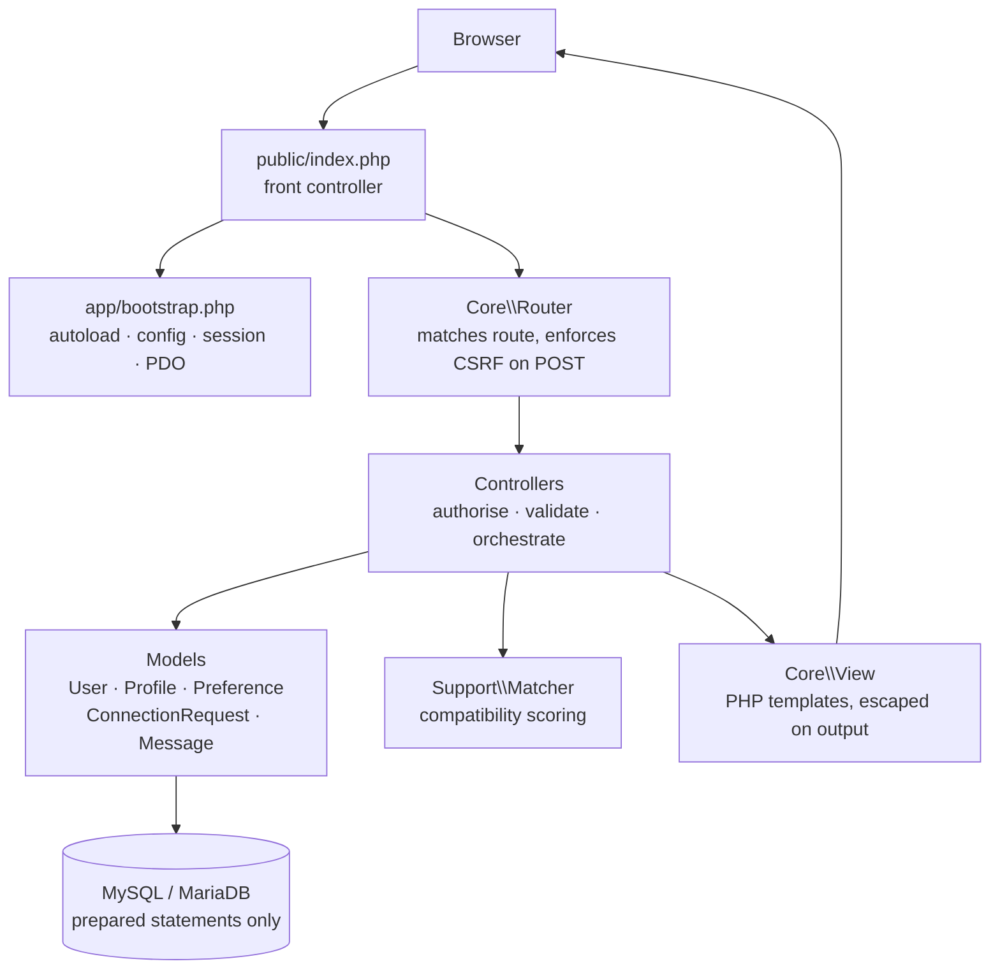

# Matrimonial Hub

A matchmaking web application — create a profile, say who you are looking for, get ranked matches, send connection requests, and chat once both sides agree.

[](https://www.php.net/)
[](https://mariadb.org/)
[](#requirements)
[](LICENSE)

This is a ground-up rebuild of [Matrimonial-Project-370](https://github.com/SammamMahdi/Matrimonial-Project-370), a CSE370 database course project. Same features, same MySQL-backed idea — rewritten with a real structure, parameterised queries throughout, working authorisation, and an interface that was designed rather than accumulated.



<table>
<tr>
<td width="50%"><br><em>Browse — every profile scored against your saved preferences, with the reasons behind the number.</em></td>
<td width="50%"><br><em>Chat — opens only between members who have both accepted.</em></td>
</tr>
<tr>
<td width="50%"><br><em>Dashboard — real counts, not the hard-coded ones the original displayed.</em></td>
<td width="50%"><br><em>Admin console — behind its own session, not the member one.</em></td>
</tr>
</table>

<sub>The interface ships in light and dark; the shots above are a mix of both. Every screenshot is the running app against the seed data in `database/seed.sql`.</sub>

---

## Contents

- [Features](#features)
- [Why it was rebuilt](#why-it-was-rebuilt)
- [Architecture](#architecture)
- [Database](#database)
- [How matching works](#how-matching-works)
- [Requirements](#requirements)
- [Getting started](#getting-started)
- [Security](#security)
- [Design](#design)
- [Project layout](#project-layout)
- [Verification](#verification)
- [Credits](#credits)

---

## Features

**For members**

- **Registration and sign-in** with bcrypt password hashing, an 18+ age check, and optional photo upload (a generated avatar stands in until you add one).
- **Your profile** — identity, education, address, physical details, biography, family background, interests and hobbies, with a live completeness meter.
- **Preferences** — the person you are looking for: gender, religion, ethnicity, profession, marital status, education, plus age and height ranges. These drive your match ranking.
- **Browse and search** — filter by any published field, combined with a compatibility score that explains itself ("Age 27 is inside your 25–32 range", "Shared interest in reading, cooking").
- **Connection requests** — send with an optional note, accept, decline, or withdraw. If you send a request to someone who already sent you one, it matches you both on the spot.
- **Chat** — available only between members who have matched, with unread counts and read receipts.

**For administrators**

- Member directory with search and status filtering.
- Activate, deactivate or suspend an account; delete a member and their photo.
- Live counts for members, requests, matches and messages, plus a recent activity feed.

## Why it was rebuilt

The original works as a demo, and the feature set was the right one — this rebuild keeps all of it. But the implementation had defects that could not be patched in place, because they came from the shape of the code rather than from individual lines. A few that shaped the rewrite:

| Original behaviour | Consequence | Now |
| :--- | :--- | :--- |
| `login.php?user_id=X` ran `SELECT * FROM user WHERE user_id = {$user_id}` and set the session | Sign in as anyone, no password. Also raw SQL injection | Endpoint deleted. Sessions are only issued by `password_verify` |
| `admin_dashboard.php` guarded on `isset($_SESSION['user_id'])` — the same key member login sets | Any logged-in member could open the admin panel and delete every account | Admins use a separate session key and a separate table |
| `sender_id` was read from a hidden form field | Send connection requests as any other user | The sender is always the session user |
| `process_request.php` updated by `request_id` alone | Anyone could accept a request sent to someone else | The `UPDATE` is scoped to `receiver_id = you` |
| `chat.php` / `get-chat.php` checked only that a user existed | Any member could read any two people's conversation | Chat requires an accepted request between the two parties |
| `request_id` was `bin2hex(random_bytes(10))` bound as an integer | The hex string cast to a small int; ~37% collapsed to `0` and silently failed the duplicate key | `AUTO_INCREMENT`, as the column always was |
| `htmlspecialchars()` used as a SQL sanitiser | Injection via backslash, and names stored double-encoded (`O&#039;Brien`) | Prepared statements everywhere; escape on output only |
| Profile save used `REPLACE INTO` with a partial column list | Every save silently wiped the member's address and phone | `INSERT … ON DUPLICATE KEY UPDATE`, touching only submitted columns |
| Admin passwords compared in plaintext (`admin1` / `password1`) | Credentials readable in the repo's SQL dump | bcrypt via `password_hash` |
| `"Match Strength: <?= rand(70, 100) ?>%"` | A number re-rolled on every page load, unrelated to either person | A real score from saved preferences, with reasons |
| Messages "encrypted" with AES-128-**ECB** and a hardcoded placeholder key in a public repo | Zero confidentiality — identical messages produced identical ciphertext | Removed. Plaintext in the database, protected by access control, which is what it always effectively was |
| `chat_users` duplicated every user's name, email and password hash | Two sources of truth, never synced; chat broke until a row was back-filled | One `users` table; messages reference it directly |
| Three different profession lists across three pages | 33 professions were selectable but unsearchable | One `Vocabulary` class every page reads from |
| One PHP file per page at the web root, plus `unzipper.php` and the SQL dump | Credentials, tooling and data all directly fetchable | Only `public/` is served; everything else sits above it |

## Architecture

No framework and no Composer — it still drops straight into `htdocs` — but the parts a framework would give you are present and separated.



The rules that keep it honest:

- **Nothing outside `public/` is reachable over HTTP.** Config, source and SQL live above the document root.
- **The router enforces CSRF**, so no controller can forget it.
- **Identity always comes from the session**, never from a form field or URL.
- **Escaping happens on output**, in the template, once.

## Database

```mermaid
erDiagram
    users ||--o| profiles : "has"
    users ||--o| preferences : "has"
    users ||--o{ connection_requests : "sends"
    users ||--o{ messages : "sends"
    users ||--o{ activity_log : "records"

    users {
        varchar user_id PK
        varchar email UK
        varchar password_hash
        date dob
        enum gender
        enum religion
        varchar profession
        enum account_status
        datetime last_seen_at
    }
    profiles {
        varchar user_id PK_FK
        enum marital_status
        decimal height_cm
        text interests
        text biography
    }
    preferences {
        varchar user_id PK_FK
        enum preferred_gender
        enum preferred_religion
        tinyint min_age
        tinyint max_age
    }
    connection_requests {
        int request_id PK
        varchar sender_id FK
        varchar receiver_id FK
        enum status
    }
    messages {
        int message_id PK
        varchar sender_id FK
        varchar receiver_id FK
        varchar body
        datetime read_at
    }
    admins {
        int admin_id PK
        varchar username UK
        varchar password_hash
    }
```

Constraints do the work the application should not be trusted to do alone: `UNIQUE (sender_id, receiver_id)` makes duplicate requests impossible, `CHECK (sender_id <> receiver_id)` blocks self-requests, and every foreign key cascades on delete so removing a member leaves nothing behind.

`preferences` is the table the original created and never read. Here it is the input to the match score.

## How matching works

Each criterion contributes its weight **only when it applies** — that is, when you expressed that preference *and* the other member published that field. The score is the achieved weight over the applicable weight, so someone who filled in two preferences is not scored against someone who filled in eight.

| Criterion | Weight | Scoring |
| :--- | ---: | :--- |
| Age | 22 | Full credit inside your range; tapers over the 6 years either side |
| Religion | 20 | Exact match |
| Shared interests & hobbies | 16 | Tag overlap, full credit at 3 shared |
| Marital status | 12 | Exact match |
| Ethnicity | 10 | Exact match |
| Height | 8 | Full credit inside your range; tapers over 15 cm |
| Profession | 7 | Full for the same job, 60% for the same field |
| Education | 5 | Holds the degree you asked for |

Every card shows the reasons behind its score, so a percentage is never just a number.

## Requirements

- **PHP 8.1+** with `pdo_mysql`
- **MySQL 5.7+ / MariaDB 10.4+**
- Apache with `mod_rewrite`, or PHP's built-in server

Nothing else. There is no `composer.json` and no build step.

## Getting started

### With XAMPP

```bash
git clone https://github.com/SammamMahdi/matrimonial-hub.git
cd matrimonial-hub

cp config/config.example.php config/config.php   # Windows: copy config\config.example.php config\config.php
```

1. Start **Apache** and **MySQL** from the XAMPP control panel.
2. Import the schema — either open <http://localhost/phpmyadmin> and import `database/schema.sql`, or:
   ```bash
   mysql -u root -p < database/schema.sql
   mysql -u root -p matrimonial < database/seed.sql   # optional demo data
   ```
3. Edit `config/config.php` if your MySQL user is not `root` with an empty password.
4. Point your virtual host's document root at the **`public/`** directory, then open <http://localhost/>.

> Serving the project folder itself instead of `public/` will work but exposes `config/` and `database/` to the web. Point at `public/`.

### Without XAMPP

```bash
mysql -u root -p < database/schema.sql
php -S localhost:8000 -t public
```

Then open <http://localhost:8000>.

### Demo accounts

`database/seed.sql` creates members you can sign in as immediately, all with the password `password123`, plus an administrator (`admin` / `admin123`) at `/admin/login`. Change these before deploying anywhere real.

## Security

What the rebuild does, and why:

- **Prepared statements for every query.** `PDO::ATTR_EMULATE_PREPARES` is off, so parameters are bound by the server rather than interpolated by the driver.
- **CSRF tokens on every state-changing request**, verified in the router with `hash_equals`.
- **Session fixation prevented** — the session id is regenerated on every privilege change.
- **Authorisation checked per action**, not per page: you may only accept a request addressed to you, and only message someone you matched with.
- **Server-side validation against a whitelist** for every dropdown, so the `ENUM` columns cannot receive values they do not accept.
- **Uploads are validated by content** (`getimagesize`), stored under a random name with an extension derived from the detected type, and capped at 4 MB.
- **Login does not leak which emails exist** — one message for both failure modes, and a dummy hash on the missing-account path so the timing matches.
- **`user_id` uses `random_int`**, not `rand()`, and is checked for collision before insert.

Nothing here is a substitute for HTTPS and a database user with only the privileges it needs.

## Design

One stylesheet, `public/assets/css/app.css`, built on CSS custom properties. The original had a different visual language in every file — a monochrome chat card, a coral admin panel, a pink request inbox, and a stylesheet left over from an unrelated student CRUD project — plus an `@import` for *Product Sans*, a proprietary font Google Fonts does not serve, so every page silently fell back to Arial.

- **Tokens, not overrides.** Every theme-dependent colour is a token defined once per theme. A component that needs a different colour in dark mode reads `--tint`; it does not carry its own `[data-theme="dark"]` rule. That is what keeps light and dark from drifting apart.
- **Dark mode** follows the system by default and the toggle overrides it in either direction, stamped before first paint so there is no white flash.
- **Motion with a purpose** — scroll reveals, a count-up on the stats, bubble entrances. All of it is bound to an `IntersectionObserver` that fires on load, so nothing can end up permanently invisible the way the original's testimonials did on a short viewport. `prefers-reduced-motion` removes every animation and transform.
- **Progressive enhancement.** Forms post normally, links navigate, content is visible. JavaScript upgrades the chat to a cursor-based poll and the nav to a drawer; without it the site still works.
- **No binary chrome.** The hero is inline SVG — a gradient with an alpona rosette and marigold strings — drawn rather than photographed. The original streamed a 97 MB `videoplayback.mp4` and a 28 MB `weddingbackground1.mp4` before the page could paint. Missing profile photos become a generated initials avatar, which also removes the original's three different broken `default-profile.png` paths.

## Project layout

```
matrimonial-hub/
├── app/
│   ├── Controllers/      # one per feature area
│   ├── Core/             # Router, Database, Auth, Csrf, Validator, View, Session
│   ├── Models/           # data access, one class per table group
│   ├── Support/          # Matcher (scoring), Vocabulary (option lists), Uploader
│   ├── Views/            # templates: layouts, partials, pages, admin
│   ├── bootstrap.php     # autoloader, config, session, PDO
│   └── helpers.php       # e(), url(), asset(), photo_url(), age_from() …
├── config/
│   ├── config.example.php
│   └── config.php        # git-ignored — your credentials
├── database/
│   ├── schema.sql
│   └── seed.sql
├── public/               # the only web-reachable directory
│   ├── assets/{css,js,img}
│   ├── uploads/          # profile photos (git-ignored)
│   ├── .htaccess
│   └── index.php         # front controller
└── README.md
```

## Verification

This was not written blind. It was built against a live MariaDB 10.11 and driven end to end before release:

- Every PHP file passes `php -l`.
- Every route returns what it should, and eleven pages render with **zero** notices, warnings or deprecations.
- **Authorisation was tested by attacking it.** A logged-in member cannot reach `/admin` (302 to the admin login). Opening `/chat/{id}` for a member you have not matched with returns **403**, and it flips to 200 the moment the match is accepted. Accepting a request addressed to somebody else leaves the row untouched in the database — verified with a `SELECT`, not by trusting the redirect.
- A `POST` without a CSRF token is rejected.
- Registration creates the user, profile and preference rows in one transaction; under-18 and duplicate emails are refused.
- Saving a profile **preserves the address and phone number** — the specific data loss the original's `REPLACE INTO` caused on every save.
- `O'Brien & Sons` survives a save/render round trip intact, and an apostrophe sent through chat is stored as typed.
- Match scores are **identical across repeated loads** of the same page. That is the whole difference from `rand(70, 100)`.

Two bugs were found this way and fixed rather than shipped: MariaDB rejects a `CHECK` constraint on any column carrying `ON UPDATE CASCADE` (so the cascade went, since `user_id` is immutable and can never cascade), and eight component colours had dark-mode rules that only applied to the manual toggle and not to system dark — which is why they are tokens now.

## Credits

Built on the original **Matrimonial-Project-370** by Sammam Mahdi and team, a CSE370 (Database Systems) project at BRAC University. The feature set, the domain and the idea are theirs; this repository is a structural and visual rebuild of it.

The demo people in `database/seed.sql` are invented, and the hero artwork is drawn in SVG. No photographs of real people are used anywhere — the original's "client stories" were stock photographs of identifiable couples with invented testimonials written underneath them, which this rebuild does not carry over.

Licensed under the [MIT License](LICENSE).
